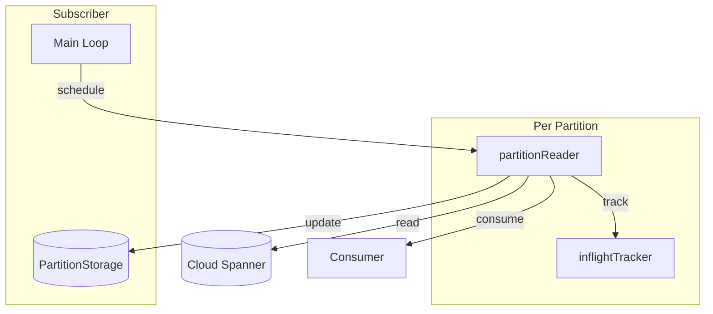

# Architecture

This document describes the design philosophy and key decisions of spream. For API usage, see the [README](README.md) and [godoc](https://pkg.go.dev/github.com/toga4/spream).

## Design Goals

1. **Simplicity over features**: Provide a minimal, focused API for reading Spanner Change Streams. Dataflow is powerful but heavyweight; the raw Change Stream API is complex. spream sits in between.

2. **Production-ready**: Support graceful shutdown, at-least-once delivery guarantees, and recovery from interruptions.

3. **Beam-compatible metadata**: Use the same PartitionMetadata data model as Apache Beam's SpannerIO connector, enabling migration to Dataflow when scaling requirements change.

4. **Single-process design**: Intentionally scoped to single-process deployments. Does not attempt to solve distributed coordination.

## Component Overview

## Design Decisions

### Why Config Struct over Functional Options

**Context**: Go libraries commonly use either Config structs or Functional Options for configuration.

**Decision**: Use a Config struct passed to NewSubscriber.

**Rationale**:
- All configuration visible in one place
- IDE autocomplete shows available options
- Validation happens at construction time with clear error messages
- Required vs optional fields are explicit (required fields have no default)
- No need to define Option types and With* functions

**Trade-off**: Less extensible for backward-compatible additions (though struct fields with zero-value defaults work well).

### Why Polling over Event Channel

**Context**: When a partition emits ChildPartitionsRecord, should we immediately schedule child partitions or wait for the next poll?

**Decision**: Use polling-based partition discovery instead of event-driven scheduling.

**Rationale**:
- Simpler implementation: no event channel, no event ordering concerns
- Termination detection is straightforward: poll returns no unfinished partitions
- The 1-second polling interval is acceptable for most use cases
- Event-driven adds complexity for marginal latency improvement

**Trade-off**: Child partition startup latency is bounded by the poll interval.

### Why http.Server-style Shutdown

**Context**: How should graceful shutdown work? Should Subscribe accept a context for cancellation?

**Decision**: Follow the http.Server pattern with separate Shutdown(ctx) and Close() methods.

**Rationale**:
- Go issue #52805 discusses why context-based shutdown is problematic for servers
- Context conflates "lifetime" with "shutdown timeout" - two different concepts
- Shutdown(ctx) clearly means "drain with this timeout"
- Close() clearly means "stop immediately"
- Familiar pattern for Go developers

### Why Continuous Ack for Watermark

**Context**: Records are processed concurrently (up to MaxInflight). How should watermark advancement work when records complete out of order?

**Decision**: Watermark advances only to the last *continuously* acknowledged sequence number.

**Rationale**:
- Out-of-order completion is expected with concurrent processing
- If seq=3 completes before seq=2, watermark cannot advance past seq=1
- On crash recovery, resumes from persisted watermark, re-delivering uncommitted records
- This is the only way to provide at-least-once guarantee with concurrent processing

### Why MaxInflight for Backpressure

**Context**: How to prevent slow consumers from causing unbounded memory growth?

**Decision**: Limit concurrent record processing per partition via MaxInflight configuration.

**Rationale**:
- Natural backpressure: when MaxInflight is reached, reader blocks until a slot becomes available
- Default of 1 provides sequential processing (simplest mental model)
- Users can increase for higher throughput when their consumer can handle concurrency
- Bounded memory: at most MaxInflight records per partition are in-flight

### Why minWatermark-based Scheduling

**Context**: When should child partitions from splits/merges be scheduled?

**Decision**: Schedule partitions only when the child partition's start timestamp is at or after the minimum watermark of all unfinished partitions.

**Rationale**:
- Ensures parents have progressed sufficiently before children start
- Prevents unbounded partition accumulation
- Mirrors Apache Beam's SpannerIO scheduling logic for compatibility
